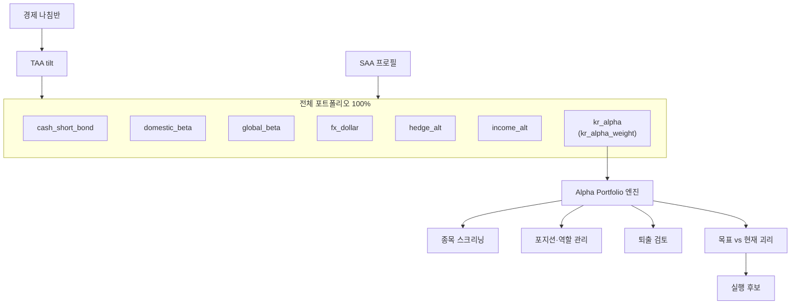

# Alpha Portfolio — 개념정집 v0.2

> **한 줄 정의**  
> Alpha Portfolio = SAA/TAA가 배정한 `kr_alpha_weight` 안에서, **KOSPI 200 대비 초과 수익**을 노리는 개별주를 규칙 기반으로 **선별·배분·진입·퇴출·리밸런싱** 하는 운용 체계

이 문서는 구현 전 **용어·역할·경계**를 고정한다.  
수익률 예측이 아니라 **일관된 알파 운용 의사결정 자동화**가 목표다.

---

## 0. 상위 시스템에서의 위치



| 계층 | 담당 질문 | Alpha 문서 범위 |
|------|-----------|-----------------|
| **SAA** | 장기 기준 `kr_alpha_weight` | ❌ 결정하지 않음 — 상위 시스템 입력 |
| **TAA** | 레짐·국면 전술 조정 | ❌ 결정하지 않음 — 상위 시스템 입력 |
| **Alpha Portfolio** | 배정된 `kr_alpha_weight` 안에서 **어떤 종목·얼마나** | ✅ 이 문서의 핵심 |
| **Trigger / Execution** | 매수 타이밍·실행 제한 | 연동만 정의 |

### 0.1 계층 경계 (필수)

**Alpha Portfolio는 `kr_alpha_weight` 자체를 고정하지 않는다.**

- `kr_alpha_weight` = SAA + TAA가 산출한 **전체 포트 대비** `kr_alpha` 비중 (동적)
- Alpha Portfolio = 그 비중 **안에서** Core/Satellite 종목 구성·role·목표·진입·퇴출만 결정

```text
[상위] kr_alpha_weight = f(SAA, TAA, 레짐)     ← 나침반 시스템
[알파] 종목별 weight = g(kr_alpha_weight, role, score)  ← Alpha Portfolio
```

예시 (설명용, 고정값 아님):

```text
전체 포트 100%
└── kr_alpha_weight  ← SAA/TAA가 결정 (예: 25~35% 범위)
    ├── Core pool    kr_alpha 슬리브 내 75% (Satellite 상한 25% 제외)
    └── Satellite    kr_alpha 슬리브 내 ≤ 25%
```

### 0.2 Alpha 개념 vs 데이터 수집 MVP 경계

| 구분 | Alpha Portfolio (개념·운용) | Data Collection MVP |
|------|----------------------------|------------------------|
| **목적** | 어떤 종목이 알파 후보인가, 어떻게 운용할 것인가 | 스크리닝에 필요한 **입력 CSV**를 채우는 것 |
| **P0 핵심** | Q/V/SR/R 스코어링·role·퇴출 규칙 | **수동 CSV + PyKRX 가격** |
| **P0 제외** | 슬리브 총량 결정, 자동매매 | OpenDART 재무 자동화, 완전 무인 수집 |
| **성공 기준** | 재현 가능한 후보·퇴출 목록 | 스키마 준수 CSV + 가격 자동 갱신 |

> P0 MVP의 핵심은 **데이터 수집기**가 아니라 **운용 판단 로직**이다.  
> 데이터 자동화는 P1(PyKRX) → P2(OpenDART) → P3(상용) 순으로 확장한다.

---

## 1. 확정 사항 (v0.2)

| 항목 | 결정 |
|------|------|
| **벤치마크** | **KOSPI 200** 기본, KOSPI 보조 |
| **Satellite 상한** | `kr_alpha` **슬리브 내 25%** 고정 |
| **모멘텀(Satellite) 단일 종목** | 슬리브 내 **5%** (예외 상향 8%, 조건부) |
| **Park 규칙** | 최대 **3개월** 관망 → 이후 Hold/Trim/Exit **강제 재심사** |
| **재무 데이터 P0** | **수동 CSV** + **PyKRX** 가격·유동성 |
| **재무 데이터 P1+** | OpenDART/API 단계적 도입 |

### 1.1 벤치마크

   KOSPI 200 기본, KOSPI 보조

| 벤치마크 | 용도 |
|----------|------|
| **KOSPI 200** | 1차 성과 비교, Selection Effect 귀속 |
| **KOSPI** | 보조 참고, 유니버스 대표성 |

- **유니버스**: KOSPI 전체 (발굴 범위)
- **성과 평가**: KOSPI 200 중심

### 1.2 Satellite 상한 — 슬리브 내 25% 고정

| `kr_alpha_weight` (전체 포트) | Satellite 최대 (전체 포트) |
|-------------------------------|---------------------------|
| 25% | 6.25% |
| 31% | 7.75% |
| 35% | 8.75% |

SAA/TAA가 슬리브 총량을 줄이면 Satellite 절대 비중도 자동 축소된다.

### 1.3 모멘텀(Satellite) 단일 종목 한도

| 기준 | 슬리브 내 | 전체 포트 (kr_alpha=31% 예시) |
|------|-----------|-------------------------------|
| 기본 | 5% | ~1.55% |
| 예외 상향 | 8% | ~2.48% |

예외 상향 조건 (모두 필요):

- 복합점수 B 이상
- 6개월 모멘텀 상위
- 실적 추정 상향
- 섹터 Risk-on
- 손절/감액 조건 YAML 명시

### 1.4 Park 규칙

Park = "안 팔고 버틴다"가 아니라 **즉시 교체하지 않고 검토 기간을 두는 상태**.

| 상황 | Park 허용 |
|--------|-----------|
| 세금·체결상 즉시 매도 불리 | ✅ |
| 일시적 실적 훼손 | ✅ |
| 손실 확정 회피 심리 | ❌ |
| 투자 논리 훼손 | ❌ |
| 회계·지배구조·유동성 문제 | ❌ → Hard Exit |

| 시점 | 행동 |
|------|------|
| 1개월 | 원인 재검토 |
| 2개월 | 대체 후보와 비교 |
| 3개월 | Hold / Trim / Exit **강제 결정** |

### 1.5 데이터 수집 로드맵

| 단계 | 방식 | 범위 |
|------|------|------|
| **P0** | 수동 CSV + PyKRX | 가격·거래대금·시총 자동, 재무·배당 수동 |
| **P1** | PyKRX 확장 | 유니버스·가격·시총·거래대금 일괄 |
| **P2** | OpenDART | 재무·배당·자사주 (계정 정규화 필요) |
| **P3** | FnGuide 등 | 정합성 보강 (비용 발생) |

---

## 2. 핵심 용어

### 2.1 Beta vs Alpha

| 구분 | 의미 | 이 시스템에서 |
|------|------|---------------|
| **Beta (β)** | 시장 전체 움직임에 따르는 수익 | `domestic_beta`, `global_beta` ETF |
| **Alpha (α)** | 벤치마크 대비 초과 수익 | `kr_alpha` 슬리브 전체 vs **KOSPI 200** |
| **알파 종목** | 초과 수익 기대 개별주 | KOSPI/KOSDAQ 주식, ETF 제외 |

> MVP에서 α = "벤치마크 대비 초과를 노리는 슬리브 + 정량 필터 통과 종목"

### 2.2 kr_alpha (자산군)

- **정의**: 종목 선택(Selection)으로 수익을 만드는 국내 주식 슬리브
- **총량 (`kr_alpha_weight`)**: SAA/TAA가 결정 — **이 문서에서 고정하지 않음**
- **벤치마크**: KOSPI 200 (1차), KOSPI (보조)
- **포함**: 개별주 (코웨이, DB손보, 오리온 등)
- **제외**: KODEX 200 등 순수 베타 ETF → `domestic_beta`

### 2.3 Alpha Portfolio (운용 체계)

`kr_alpha_weight` **내부** 운용:

```text
유니버스 정의
→ 정량 스크리닝 (Q, V, SR, Risk)
→ 후보 등급 (A/B/C/Watch/Reject)
→ Role (Core / Satellite)
→ 목표 매트릭스 (슬리브·전체 포트 기준)
→ 보유 vs 목표 괴리
→ 진입·퇴출·Park
→ 상위 Trigger / Execution 합류
```

### 2.4 Role (종목 역할)

| role | 의미 | Tier |
|------|------|------|
| `quality_dividend` | 배당·현금흐름 안정 | Core |
| `quality_defensive` | 방어적 소비·실적 안정 | Core |
| `defensive_consumer` | 필수소비·브랜드 | Core |
| `value_defensive` | 저평가 + 실적 방어 | Core |
| `shareholder_return` | 자사주·배당 정책 | Core |
| `value_rerating` | 리레이팅 기대 밸류 | Core / Satellite |
| `value_quality` | 품질+밸류 | Core |
| `dividend_value` | 배당 밸류 | Core |
| `momentum_satellite` | 모멘텀·테마 | Satellite only |
| `cyclical_value` | 경기민감 밸류 | Satellite, 상한 엄격 |

### 2.5 Tier (포지션 층)

| Tier | 슬리브 내 비중 | 특징 |
|------|----------------|------|
| **T1 Core** | 75% (Satellite 25% 제외) | 3~5년, quality/value, 낮은 회전율 |
| **T2 Satellite** | ≤ 25% | 모멘텀·사이클, 엄격 퇴출 |
| **T3 Candidate** | 0% | 스크리닝 통과, 비보유 |
| **T4 Park** | 0% (target) | 관망, 최대 3개월 |

---

## 3. 투자 철학

### 3.1 추구 / 비추구

| 추구 | 비추구 |
|------|--------|
| Quality + Value + 주주환원 | 테마·뉴스 매매 |
| KOSPI 200 대비 안정적 초과 | 고레버리지 성장 스토리 |
| 규칙 기반 퇴출 | "좋은 회사" 무한 보유 |

### 3.2 Factor Hypothesis — QVM-SR

1. **Quality** — ROE, 이익 안정, 부채 건전성
2. **Value** — 섹터 상대 PER/PBR/EV/EBITDA
3. **Shareholder Return** — 배당, 자사주
4. **Low Risk** — 변동성, MDD

모멘텀: **Satellite 전용**. Core에는 가점 최소.

### 3.3 DNA와 리스크

현재 DNA: **품질 + 저평가 + 주주환원 + 방어성**

| 리스크 | 대응 |
|--------|------|
| 스타일 쏠림 (consumer/holding) | 섹터·role 상한 |
| 밸류트랩 | Q + SR + 이익 안정 Gate |
| Satellite 과다 | 슬리브 내 25% cap |
| 데이터 오류 | P0 수동 검증 컬럼 |

---

## 4. 목표 구조 (Target Matrix)

### 4.1 비중 표현 규칙

종목 비중은 **두 단위**를 구분한다:

| 단위 | 의미 | 사용처 |
|------|------|--------|
| `sleeve_weight` | `kr_alpha` 슬리브 **내부** % | role 한도, Satellite cap |
| `portfolio_weight` | 전체 포트 % | `target_portfolio.csv`, gap 계산 |

```text
portfolio_weight = kr_alpha_weight × sleeve_weight / 100
```

Alpha Portfolio 문서·스키마는 **슬리브 내부 비중**과 **전체 포트 비중**을 혼용하지 않는다.

### 4.2 종목별 목표 스키마

`target_portfolio.csv` (상위 시스템 연동, `portfolio_weight` 기준):

| 컬럼 | 설명 |
|------|------|
| `ticker` | 종목코드 |
| `asset_group` | `kr_alpha` |
| `sector` | 섹터 |
| `role` | §2.4 |
| `target_weight` | **전체 포트** 대비 % |
| `min_weight` / `max_weight` | 전체 포트 기준 밴드 |

### 4.3 집중도 한도

| 한도 | 값 | 비고 |
|------|-----|------|
| `kr_alpha_weight` | SAA/TAA | 상위 HARD (예: 20~35%) |
| Satellite (슬리브 내) | 25% | Alpha 문서 고정 |
| Satellite 단일 종목 (슬리브 내) | 5% (예외 8%) | Alpha 문서 고정 |
| Core 단일 종목 (전체 포트) | 8% SOFT / 15% HARD | 상위 `portfolio_policy` |
| 섹터 (전체 포트) | 30% | SOFT |

---

## 5. 선별 (Screening) 개념

### 5.1 유니버스

| 포함 | 제외 |
|------|------|
| KOSPI/KOSDAQ 주식 | ETF, ETN, SPAC |
| 시총 ≥ 3,000억 | 관리·거래정지 |
| 20일 평균 거래대금 ≥ 10억 | 2년 연속 적자, 감사 한정 |

### 5.2 파이프라인

```text
Gate → Q/V/SR/R Score → Role → Grade → Target Matrix
```

### 5.3 등급

| 등급 | 행동 |
|------|------|
| **A** | Core 후보 |
| **B** | Satellite 후보 |
| **C** | Watch |
| **Reject** | 제외 |

보유 종목 +3점 (퇴출 발동 시 무효).

---

## 6. 진입·퇴출·Park

### 6.1 진입 (Entry)

AND: 등급 A/B · 매트릭스 존재 · underweight · 레짐 ≥ YELLOW_STABLE · 트리거/리밸런스 · Data Gate GREEN

### 6.2 퇴출 (Exit)

| 유형 | 행동 |
|------|------|
| Hard Exit | `Replace` |
| Soft Exit | `Trim` → `Replace` |
| Role Exit (Satellite) | 전량 퇴출 |
| 슬리브 축소 | 상위 TAA |

> `kr_alpha` **총량**은 TAA 영역. Alpha는 **슬리브 내부** 종목 배분만 담당.

### 6.3 Park

- `target_weight = 0`, `asset_group = kr_alpha` 유지
- **최대 3개월** → §1.4 재심사

---

## 7. 레짐·국면 (참조)

Alpha Portfolio는 **슬리브 총량 tilt**를 결정하지 않는다.  
아래는 상위 `saa_profiles.yaml` 참조용.

| 레짐 | 상위 `kr_alpha` tilt | Alpha 운용 |
|------|------------------------|------------|
| RISK_ON | +5%p | Satellite 소폭 |
| CAUTION | -5%p | 신규 대기 |
| CRISIS | -15%p | 신규 중단, Hard Exit |

---

## 8. 성과·귀속

| 비교 | 용도 |
|------|------|
| `kr_alpha` vs **KOSPI 200** | 슬리브 알파 (1차) |
| `kr_alpha` vs KOSPI | 보조 |
| Selection Effect | 슬리브 내 종목 vs KOSPI 200 |

---

## 9. MVP 범위

### 9.1 P0 Alpha

```text
개념정집 v0.2 확정
→ 01_데이터_스키마.md
→ 02_스코어링_설계.md
→ 스크리너 v0.1 (수동 CSV + PyKRX)
→ 퇴출 v0.1
→ 목표 매트릭스 괴리 연동
```

### 9.2 P0 제외

- `kr_alpha_weight` 산출 (상위 시스템)
- OpenDART 자동화
- 자동매매·ML·GPT 단독 추천

### 9.3 한 문장 MVP

> **Alpha P0 = KOSPI 유니버스 + 수동 재무 CSV + PyKRX 가격 → `kr_alpha_weight` 안에서 Core/Satellite 후보·퇴출·괴리를 산출하는 반자동 운용 보조 엔진**

---

## 10. 용어 사전

| 용어 | 정의 |
|------|------|
| **kr_alpha_weight** | SAA/TAA가 정한 전체 포트 대비 `kr_alpha` 비중 (Alpha가 고정 안 함) |
| **sleeve_weight** | `kr_alpha` 슬리브 **내부** 종목 비중 |
| **Core / Satellite** | T1 / T2 tier |
| **QVM-SR** | Quality + Value + (제한) Momentum + Shareholder Return |
| **Data Gate** | GREEN / YELLOW / RED |
| **Park** | target=0, 최대 3개월 관망 |

---

## 11. 문서 로드맵

| 순서 | 문서 | 이유 |
|------|------|------|
| **01** | `01_데이터_스키마.md` | 점수화 전 컬럼 고정 |
| **02** | `02_스코어링_설계.md` | Q/V/SR/R 계산 |
| **03** | `03_퇴출_규칙.md` | Hard/Soft Exit, Park |
| **04** | `04_목표매트릭스_가이드.md` | sleeve vs portfolio weight, target_draft |

---

*Alpha Portfolio 개념정집 v0.2 — 2026-06-17*  
*상위: `investment-saa-alpha` (monorepo; 구 `multi_asset_trigger_portfolio`)*
